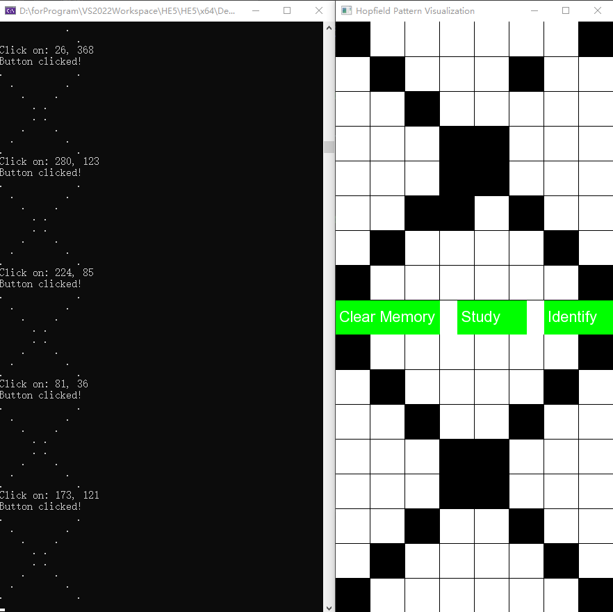

# Hopfield Network Machine C++
A based Hopfield Network Machine prototype, it just has 64 neurons to study the 8x8 input matrix.

It use SFML 2.6.1 Visual C++ 17 (2022) - 64-bit to realize the UI for user input.

Upper is the input, and below is the result of input recognition.

Running Preview:

